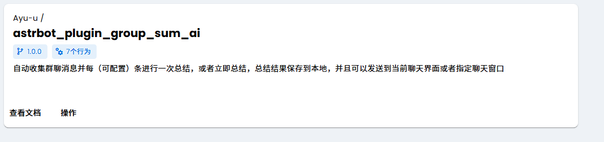
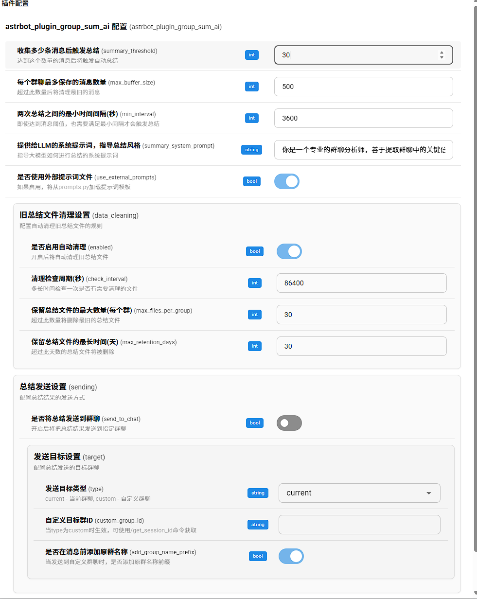
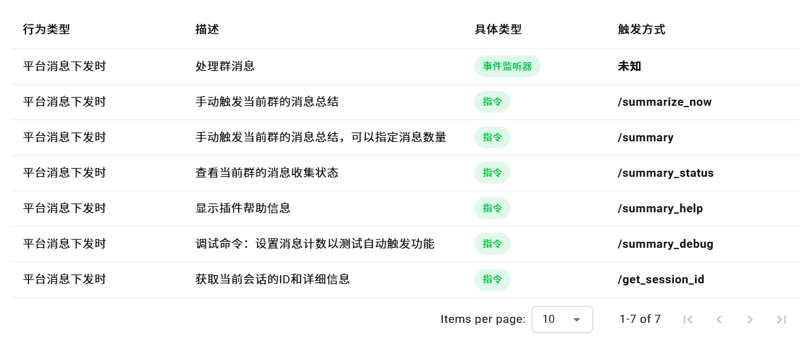
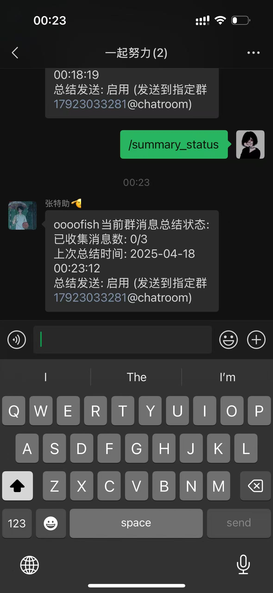
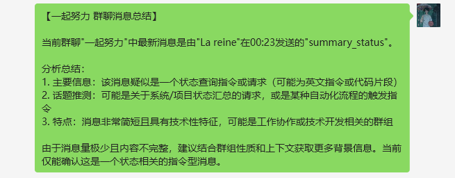
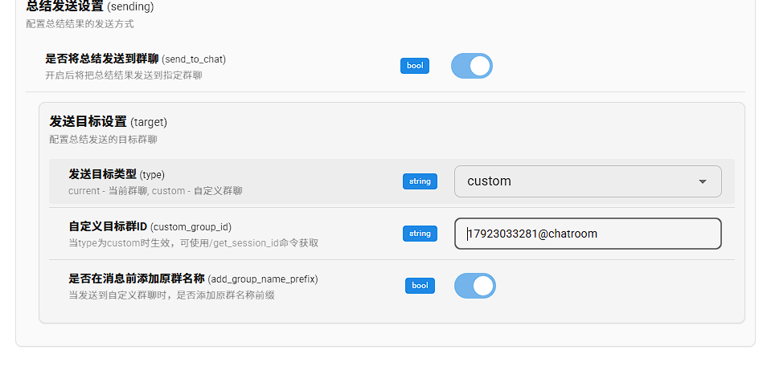

# 群聊消息自动总结插件 (astrbot_plugin_group_sum_ai)

## 简单介绍

群聊消息自动总结插件能够自动收集群聊中的消息，并在达到设定的消息数量阈值后，使用大模型自动总结群聊内容，提取重要信息和主要话题。总结结果可以保存在本地文件中，也可以根据配置发送到群聊中。

### 安装方法

1. 确保 AstrBot 已正确安装并运行
2. 将整个插件文件夹放入 AstrBot 的 `data/plugins/` 目录下
3. 重启 AstrBot，插件将自动加载



### 基本使用

插件加载后会自动开始收集群聊消息，无需任何手动操作。当某个群的消息累计达到阈值（默认300条）且距离上次总结时间超过设定间隔（默认1小时）后，插件会自动进行总结。



可用命令：


- `/summary_status` - 查看当前群的消息收集状态
- 
- `/summarize_now` - 立即总结当前收集的所有消息(仅管理员)
- `/summary [数量]` - 立即总结指定数量的最近消息(仅管理员)
- `/summary_debug [计数]` - 设置消息计数器的值(仅管理员)
- `/get_session_id` - 获取当前会话的ID信息
- `/summary_help` - 显示插件帮助信息
- `/summary_api_info` - 显示API相关信息（仅管理员，需启用API功能）

## 功能介绍

### 核心功能

1. **自动总结** - 当群聊消息达到设定阈值且满足时间间隔时，自动总结群聊内容


2. **手动总结** - 支持管理员手动触发总结，可指定总结消息数量
3. **数据自动清理** - 自动清理旧的总结文件，节约存储空间
4. **总结内容发送** - 可将总结结果发送到当前群聊或指定的群聊
5. **自定义提示词** - 支持通过外部文件自定义详细的提示词，优化总结效果
6. **HTTP API 接口** - 提供REST API接口，支持通过外部程序发送消息

### 总结结果查看

总结结果会根据配置：
1. 保存在 `data/group_summaries/` 目录下，文件名格式为：`群ID_日期_时间.txt`
2. 如果配置了发送选项，还会将总结内容发送到当前群聊或指定的群聊
特别感谢astrbot_plugin_push_lite提供的api
总结文件包含以下内容：
- 群名称和群ID
- 总结时间
- 总结的消息数量
- 详细的总结内容

### 数据自动清理

插件支持自动清理旧的总结文件，避免占用过多存储空间：

1. **按数量清理** - 为每个群保留最近的N个总结文件，超过则删除最旧的
2. **按时间清理** - 删除超过指定天数的总结文件

### 自定义提示词

插件支持自定义提示词，可通过编辑插件目录下的 `prompts.py` 文件进行修改。该文件包含：

- **SYSTEM_PROMPT** - 系统提示词，指导AI总结的风格和方向
- **SUMMARY_PROMPT_TEMPLATE** - 消息总结提示词模板
- **MESSAGE_FORMAT** - 单条消息格式模板
- **FEW_MESSAGES_PROMPT** - 消息数量过少时的额外提示词

## 配置介绍

### 配置方式

AstrBot v3.4.15+版本支持通过管理面板配置插件：

1. 打开AstrBot管理面板
2. 进入"插件"页面
3. 找到"群聊消息总结"插件
4. 点击"管理"，然后点击"配置"
5. 在配置面板中修改所需参数
6. 点击"保存"应用配置

### 配置项说明

#### 基础配置

- **触发总结阈值** - 收集多少条消息后触发总结（默认300条）
- **最大缓冲区大小** - 每个群聊最多保存的消息数量（默认500条）
- **最小总结间隔** - 两次总结之间的最小时间间隔（默认3600秒）
- **总结系统提示词** - 提供给LLM的系统提示词，指导总结风格
- **使用外部提示词文件** - 是否使用prompts.py中定义的外部提示词

#### 数据清理配置

- **启用自动清理** - 是否启用自动清理旧总结文件
- **清理检查周期** - 多长时间检查一次是否有需要清理的文件
- **最大文件数量** - 每个群保留的最大总结文件数量
- **最长保留天数** - 总结文件最长保留的天数

#### 发送配置

- **发送到群聊** - 是否将总结结果发送到群聊
- **目标类型** - 发送到当前群聊还是自定义群聊
- **自定义群ID** - 当选择发送到自定义群聊时的目标群ID
- **添加群名前缀** - 是否在消息前添加原群名称
id可以在日志中查询


#### API 配置

- **启用API** - 是否启用HTTP API功能
- **API主机** - API服务监听的主机地址（默认0.0.0.0）
- **API端口** - API服务监听的端口（默认9966）
- **API令牌** - 用于API认证的令牌，首次启用时自动生成

### 配置注意事项

1. 配置修改后会立即生效，不需要重启AstrBot
2. 总结系统提示词支持直接在管理面板中编辑，无需修改prompts.py文件
3. 如果要使用更复杂的提示词模板，建议启用"使用外部提示词文件"，并编辑prompts.py文件
4. API令牌应妥善保管，泄露可能导致安全风险

## HTTP API 接口

### API 概述

插件提供了HTTP API接口，允许外部程序通过API调用发送消息。默认情况下，API功能是禁用的，需要在插件配置中启用。

### 查看API信息

在任意群聊中发送 `/summary_api_info` 命令可以查看API相关信息，包括：
- API访问地址和端口
- API认证令牌
- 简单的调用示例

### API 客户端

插件提供了简单的API客户端实现，可以通过命令行或集成到其他程序中使用：
- `api_client.py` - API客户端核心库，提供API调用函数
- `api_example.py` - 使用示例，展示如何调用API

### API 接口文档

#### 1. 发送消息

**接口**：`POST /send`

**请求头**：
```
Authorization: Bearer <API_TOKEN>
Content-Type: application/json
```

**请求体**：
```json
{
  "content": "消息内容或base64编码的图片",
  "umo": "目标会话标识",
  "type": "消息类型，text或image",
  "callback_url": "可选，处理结果回调URL"
}
```

**参数说明**：
- `content`: 如果type=text，则为文本内容；如果type=image，则为Base64编码的图片内容
- `umo`: 目标会话标识，可通过 `/get_session_id` 命令获取
- `type`: 消息类型，可选值为"text"或"image"，默认为"text"
- `callback_url`: 可选，消息处理完成后的回调URL

**响应**：
```json
{
  "status": "queued",
  "message_id": "生成的消息ID",
  "queue_size": 1
}
```

#### 2. 健康检查

**接口**：`GET /health`

**响应**：
```json
{
  "status": "ok",
  "queue_size": 1
}
```

#### 3. 回调通知

如果提供了 `callback_url`，当消息处理完成后，API服务会向该URL发送POST请求：

**成功**：
```json
{
  "message_id": "原始消息ID",
  "success": true
}
```

**失败**：
```json
{
  "message_id": "原始消息ID",
  "success": false,
  "error": "错误信息"
}
```

### API 客户端使用示例

#### 安装依赖

```bash
pip install requests
```

#### 发送文本消息

```bash
python api_client.py --token "您的API令牌" --umo "目标会话ID" --type text --content "这是一条测试消息"
```

#### 发送图片消息

```bash
python api_client.py --token "您的API令牌" --umo "目标会话ID" --type image --image "图片路径.jpg"
```

#### 健康检查

```bash
python api_client.py --type health
```

#### 使用回调URL

```bash
python api_client.py --token "您的API令牌" --umo "目标会话ID" --type text --content "带回调的消息" --callback "http://your-server.com/callback"
```

## 开发者信息

- **插件名称**: group-summarizer
- **版本**: 1.0.0
- **作者**: Ayu-u
- **仓库**: https://github.com/Ayu-u/astrbot_plugin_group_sum_ai

## 更新情况

### v1.1.0 (2025-05-01)

1. **新增HTTP API功能**
   - 添加HTTP API服务，支持通过API发送消息
   - 提供健康检查接口和回调通知机制
   - 提供完整的API客户端和使用示例

2. **安全性增强**
   - API访问需要令牌认证，防止未授权访问
   - 首次启用API时自动生成安全令牌

### v1.0.0 (2025-04-17)

1. **配置系统升级**
   - 添加了符合AstrBot v3.4.15+新标准的`_conf_schema.json`配置Schema文件
   - 修改了插件初始化逻辑，支持AstrBot直接注入配置
   - 保留了向下兼容性，当没有找到配置时会使用默认值

2. **错误修复**
   - 修复群ID格式问题，支持不同平台的消息发送
   - 修复异步生成器错误，正确使用yield而不是await
   - 修复LLM提供商获取方法，使用`get_using_provider()`
   - 修复权限检查错误，使用正确的`permission_type`
   - 修复枚举值错误，使用正确的`EventMessageType.GROUP_MESSAGE`
   - 修复导入错误，移除不必要的导入语句
  


   - TODO：保存群聊消息到本地，设置多个总结消息的id，设置只针对自定义白名单启动总结，支持qq
